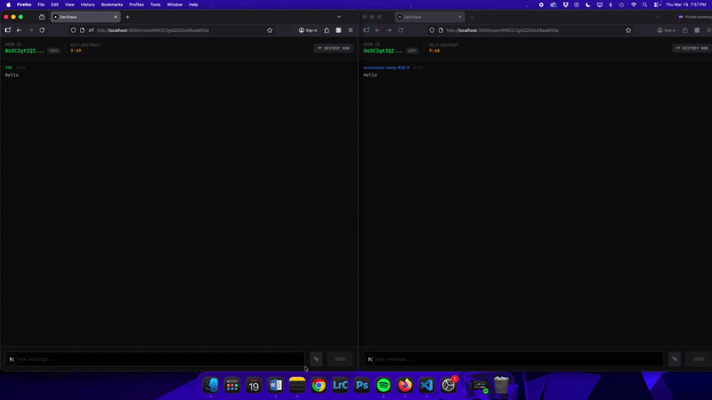

# 🕵️‍♂️ zero_trace | Ephemeral Real-Time Chat

A **private, self-destructing chat application** built with **Next.js, Elysia, Redis, and Upstash Realtime**.  
Supports anonymous usernames, instant messaging with images, and ephemeral rooms that automatically expire or can be manually destroyed.

<p align="center">
  
</p>

<p align="center">
  
</p>

<p align="center">
  
  
  
  
  
  
  
</p>

---

## ✨ Core Features

- **Anonymous Identity** — Automatic username generation via `useUsername` hook  
- **Self-Destructing Rooms** — TTL-based ephemeral chat rooms (10 min default)  
- **Manual Destruction** — Users can destroy a room anytime, notifying all participants  
- **Real-Time Messaging** — Instant text & image messages using Upstash Realtime  
- **Image & GIF Uploads** — Upload images and GIFs with real-time preview modal  
- **Dark/Light Theme Toggle** — Persistent UI theme with smooth transitions  
- **Secure Access Control** — Proxy middleware and auth tokens stored in HTTP-only cookies  
- **Room Access Validation** — Max 2 participants per room; redirects for invalid/full rooms  
- **Redis-Powered Backend** — Message persistence, TTL management, and housekeeping  
- **Clipboard Support** — Copy room links with instant feedback  

---

## 🛠️ Tech Stack

| Layer | Technology |
|-------|------------|
| Frontend | Next.js, React 19, TypeScript |
| Styling | Tailwind CSS v4 |
| State & Data | React Query, useUsername Hook |
| Backend | ElysiaJS, TypeScript |
| Realtime | Upstash Realtime |
| Database | Redis |
| Utilities | nanoid, date-fns, zod |
| File Storage | Vercel Blob (images & GIFs) |

---

## 🚀 Project Enhancements & Solutions

### 1️⃣ Secure Room Access

**Problem:** Need to restrict room access to valid participants.  

**Solution:**  
- `proxy.ts` middleware assigns unique auth tokens.  
- Maximum 2 participants enforced.  
- Redirects for `room-not-found` or `room-full`.  

**Lesson Learned:** Middleware enables lightweight, server-side access control without additional API calls.

---

### 2️⃣ Self-Destructing Rooms

**Problem:** Rooms needed automatic cleanup for privacy.  

**Solution:**  
- TTL in Redis triggers automatic expiration (10 min).  
- Manual destroy button emits `chat.destroy` event via Realtime.  
- All room metadata and messages are cleaned up automatically.  

**Lesson Learned:** TTL combined with Realtime notifications ensures both automatic and manual destruction work seamlessly.

---

### 3️⃣ Real-Time Messaging System

**Problem:** Messages needed to appear instantly without page reloads.  

**Solution:**  
- Upstash Realtime channels emit `chat.message` events.  
- Messages stored in Redis for persistence and housekeeping.  
- Image uploads handled via `/api/upload` endpoint.  

**Lesson Learned:** Combining Realtime events with Redis persistence ensures reliability and consistency.

---

### 4️⃣ Anonymous Identity Management

- `useUsername` hook generates randomized usernames.  
- Stored in `localStorage` for session persistence.  
- Easy to expand with additional username generators.

---

### 5️⃣ UI & UX Polish
 
- Responsive design for desktop, tablet, and mobile.  
- Hover effects, modal animations, and live TTL countdowns.  
- Image modals scale and fade-in for enhanced interactivity.

---

### 6️⃣ Architecture Refinement

- Modular Elysia routes for `/room` and `/messages`.  
- Auth middleware handles token validation across endpoints.  
- Proxy middleware centralizes access control before room entry.  
- Frontend `Providers.tsx` wraps React Query and Realtime for global state.  

**Technical Growth Achieved:**  
Realtime architecture, ephemeral backend design, middleware-based auth, responsive and polished UX.

---

### 7️⃣ Image & GIF Uploads on Vercel

**Problem:**  
- Uploads worked locally with `fs` but failed on Vercel.  
- Errors included `500` responses and "No token found" for blob storage.  
- Pre-existing solutions using `/public/uploads` do **not persist** on serverless platforms.  

**Solution:**  
- Switched to **Vercel Blob storage** for serverless-friendly file hosting.  
- Added validations for:
  - Allowed types (`image/png`, `image/jpeg`, `image/gif`)  
  - Max file size (`5 MB`)  
- Generated unique filenames using `Date.now()` + original name to avoid collisions.  
- Uploaded files are **publicly accessible** via a URL, compatible with your chat modal.  

**Lesson Learned:**  
Serverless environments require **external or cloud-backed storage** for persistent uploads. Local `fs` works in development but **not on Vercel**. Using Vercel Blob ensures images and GIFs display properly in real-time chat.

---

### 8️⃣ Future Implementations

- Light mode
- More users allowed in the room (will need more space for backend, possibly paid account)
- Emoji & reactions support
- Implement the support of video and files beyond images like pdf, mp4, mov etc.
- Offline support with local caching
- Custom TTL per room on creation

---

## 👨‍💻 Installation

**Requirements:** Node.js 20+, Redis

```bash
# Clone the repository
git clone https://github.com/<your-username>/zero_trace.git
cd zero_trace

# Install dependencies
npm install

# Start development server
npm run dev

# Build for production
npm run build

# Preview production build
npm run preview